# Online24 Pharmacy - Database Design Documentation

## Project Overview

Online24 Pharmacy is a comprehensive e-commerce platform for pharmaceutical products with prescription management, inventory tracking, and delivery services. The system supports user authentication, product catalog management, order processing, prescription verification, and administrative functions.

## Database Architecture

- **Database Management System**: PostgreSQL
- **ORM**: Prisma Client
- **Architecture**: Relational Database with normalized schema
- **Primary Key Strategy**: CUID for most entities, UUID for users
- **Indexing Strategy**: Strategic indexes on frequently queried fields

---

## Entity-Relationship Diagram (ERD) Overview

````mermaid
erDiagram
    User ||--o{ Session : "1:N"
    User ||--o{ Address : "1:N"
    User ||--o{ Order : "1:N"
    User ||--o{ Prescription : "1:N"
    User ||--o{ CartItem : "1:N"
    User ||--o{ WishlistItem : "1:N"
    User ||--o{ Review : "1:N"
    User ||--o{ SavedKit : "1:N"
    User ||--o{ Notification : "1:N"
    User ||--o{ AdminLog : "1:N (if admin)"
    User ||--o{ AuditLog : "1:N"
    Category ||--o{ Subcategory : "1:N"
    Category ||--o{ Product : "1:N"
    Subcategory ||--o{ Product : "1:N"
    Product ||--o{ Review : "1:N"
    Product ||--o{ CartItem : "1:N"
    Product ||--o{ WishlistItem : "1:N"
    Product ||--o{ OrderItem : "1:N"
    Product ||--o{ Inventory : "1:N"
    Order ||--o{ OrderItem : "1:N"
    Order ||--o{ OrderTracking : "1:N"
    Order }o--o| Prescription : "N:1 (optional)"
    Supplier ||--o{ Inventory : "1:N"
    PickupLocation ||--o{ Inventory : "1:N"
    Shop
    Promotion
    Coupon
    DeliveryZone
    GeocodeCache
    ChatbotDocument
    VectorEmbedding
    Order }o--o| DeliveryZone : "N:1 (optional)"
    Notification }o--|| User : "N:1"
    Review }o--|| User : "N:1"
    Review }o--|| Product : "N:1"
    CartItem }o--|| User : "N:1"
    CartItem }o--|| Product : "N:1"
    WishlistItem }o--|| User : "N:1"
    WishlistItem }o--|| Product : "N:1"
    OrderItem }o--|| Order : "N:1"
    OrderItem }o--|| Product : "N:1"
    OrderTracking }o--|| Order : "N:1"
    Inventory }o--|| Product : "N:1"
    Inventory }o--|| PickupLocation : "N:1"
    Inventory }o--o| Supplier : "N:1 (optional)"
    Prescription }o--|| User : "N:1"
    SavedKit }o--|| User : "N:1"
    Address }o--|| User : "N:1"
    AdminLog }o--|| User : "N:1"
    AuditLog }o--|| User : "N:1"
    Session }o--|| User : "N:1"
    Subcategory }o--|| Category : "N:1"
---

## Interface Design

Interface design focuses on the user interfaces (UI) and user experience (UX) for the Online24 Pharmacy system. The design emphasizes usability, accessibility, and responsiveness across devices. Below are key interface designs with wireframe-like descriptions.

### 1. Login Page

**Purpose**: Allow users to authenticate and access the system.

**Elements**:
- Email/Phone input field
- Password input field (with show/hide toggle)
- "Remember Me" checkbox
- Login button
- "Forgot Password" link
- "Register" link for new users
- Error messages for invalid credentials

**Layout**:
```
+-----------------------------+
|        Online24 Pharmacy    |
|                             |
| Email/Phone: [___________]  |
| Password:    [___________]  |
| [ ] Remember Me             |
|                             |
|        [Login]              |
| Forgot Password? | Register |
+-----------------------------+
```

### 2. User Registration Page

**Purpose**: Register new customers.

**Elements**:
- First Name, Last Name inputs
- Email, Phone inputs
- Password, Confirm Password inputs
- Role selection (Customer by default)
- Terms & Conditions checkbox
- Register button
- Validation messages

**Layout**:
```
+-----------------------------+
|        Register Account     |
|                             |
| First Name: [___________]   |
| Last Name:  [___________]   |
| Email:      [___________]   |
| Phone:      [___________]   |
| Password:   [___________]   |
| Confirm:    [___________]   |
| [ ] Accept Terms            |
|                             |
|        [Register]           |
+-----------------------------+
```

### 3. Product Catalog Page

**Purpose**: Browse and search products.

**Elements**:
- Search bar
- Category filters (dropdown/side menu)
- Product grid/list view (image, name, price, add to cart button)
- Pagination
- Sort options (price, name, etc.)

**Layout**:
```
+-----------------------------+
| Search: [___________] [Go]  |
| Categories: [Dropdown]      |
|                             |
| [Product1] [Product2]       |
| Name: $Price [Add to Cart]  |
|                             |
| [Product3] [Product4]       |
| Name: $Price [Add to Cart]  |
|                             |
| [1] [2] [3] ... [Next]      |
+-----------------------------+
```

### 4. Product Details Page

**Purpose**: View detailed product information.

**Elements**:
- Product image gallery
- Name, description, price
- Quantity selector
- Add to Cart/Wishlist buttons
- Reviews section
- Related products

**Layout**:
```
+-----------------------------+
| [Image Gallery]             |
| Product Name                |
| Description...              |
| Price: $XX.XX               |
| Quantity: [1] [+] [-]       |
| [Add to Cart] [Wishlist]    |
|                             |
| Reviews:                    |
| - Review1                   |
| - Review2                   |
+-----------------------------+
```

### 5. Shopping Cart Page

**Purpose**: Manage cart items before checkout.

**Elements**:
- List of cart items (image, name, quantity, price, remove button)
- Subtotal, discounts, total
- Coupon code input
- Update Cart button
- Proceed to Checkout button

**Layout**:
```
+-----------------------------+
| Cart Items:                 |
| [Img] Name Qty Price [X]    |
| [Img] Name Qty Price [X]    |
|                             |
| Subtotal: $XX.XX            |
| Discount: -$X.XX            |
| Total: $XX.XX               |
| Coupon: [___________] [Apply|
|                             |
| [Update Cart] [Checkout]    |
+-----------------------------+
```

### 6. Checkout Page

**Purpose**: Complete the order.

**Elements**:
- Shipping address selection/form
- Payment method selection
- Order summary
- Place Order button

**Layout**:
```
+-----------------------------+
| Shipping Address:           |
| [Select Address] or Form    |
|                             |
| Payment Method:             |
| [Card] [Cash on Delivery]   |
| Card Details: ...           |
|                             |
| Order Summary:              |
| Items: $XX.XX               |
| Shipping: $X.XX             |
| Total: $XX.XX               |
|                             |
| [Place Order]               |
+-----------------------------+
```

### 7. Admin Dashboard

**Purpose**: Administrative overview.

**Elements**:
- Navigation menu (Users, Products, Orders, etc.)
- Statistics cards (total users, orders, revenue)
- Recent activities
- Quick actions

**Layout**:
```
+-----------------------------+
| Admin Dashboard             |
|                             |
| [Users] [Products] [Orders] |
|                             |
| Stats:                      |
| Users: 1000 Orders: 500     |
| Revenue: $10,000            |
|                             |
| Recent:                     |
| - New order #123            |
| - User registered           |
+-----------------------------+
```

### 8. Prescription Upload Page

**Purpose**: Upload prescription images.

**Elements**:
- File upload area (drag & drop or browse)
- File type/size validation
- Upload button
- Status messages

**Layout**:
```
+-----------------------------+
| Upload Prescription         |
|                             |
| [Drag & Drop or Browse]     |
| Supported: JPG, PNG, PDF    |
| Max size: 5MB               |
|                             |
| [Upload]                    |
| Status: Uploaded successfully|
+-----------------------------+
```

### Design Principles

- **Responsive Design**: Mobile-first approach using CSS frameworks like Tailwind CSS.
- **Accessibility**: WCAG compliance with proper ARIA labels, keyboard navigation.
- **Consistency**: Unified color scheme (blue for primary actions), fonts, and icons.
- **Security**: Secure forms with CSRF protection, input sanitization.
- **Performance**: Lazy loading images, optimized assets.

---

## Data Flow Diagrams (DFD)

### DFD Level 0: Context Diagram

The Level 0 DFD provides an overview of the Online24 Pharmacy system as a single process interacting with external entities.

```mermaid
flowchart TD
    A[Customer] -->|Place Order, Upload Prescription| P[Online24 Pharmacy System]
    B[Admin] -->|Manage Products, Users, Reports| P
    C[Pharmacist] -->|Verify Prescriptions, Manage Inventory| P
    D[Delivery Partner] -->|Update Delivery Status| P
    E[Supplier] -->|Supply Products| P
    F[Payment Gateway] -->|Process Payments| P
    G[Geocoding Service] -->|Geocode Addresses| P
    H[Chatbot User] -->|Query Information| P

    P -->|Order Confirmation, Invoices| A
    P -->|Reports, Analytics| B
    P -->|Prescription Status| C
    P -->|Delivery Assignments| D
    P -->|Purchase Orders| E
    P -->|Payment Status| F
    P -->|Geocoded Data| G
    P -->|Responses| H
````

### DFD Level 1: System Overview

The Level 1 DFD decomposes the main system into major processes, data stores, and flows.

```mermaid
flowchart TD
    %% External Entities
    Cust[Customer]
    Adm[Admin]
    Pharm[Pharmacist]
    Del[Delivery Partner]
    Supp[Supplier]
    Pay[Payment Gateway]
    Geo[Geocoding Service]
    Chat[Chatbot User]

    %% Processes
    UM[1. User Management]
    PM[2. Product Management]
    OM[3. Order Management]
    PresM[4. Prescription Management]
    IM[5. Inventory Management]
    DM[6. Delivery Management]
    RM[7. Reporting & Analytics]
    CM[8. Chatbot Management]

    %% Data Stores
    UDB[(User Database)]
    PDB[(Product Database)]
    ODB[(Order Database)]
    PresDB[(Prescription Database)]
    IDB[(Inventory Database)]
    DDB[(Delivery Database)]
    RDB[(Reports Database)]
    CDB[(Chatbot Database)]

    %% Flows
    Cust -->|Login, Register| UM
    Cust -->|Browse, Search Products| PM
    Cust -->|Add to Cart, Checkout| OM
    Cust -->|Upload Prescription| PresM
    Adm -->|CRUD Users| UM
    Adm -->|CRUD Products| PM
    Adm -->|View Orders| OM
    Adm -->|Verify Prescriptions| PresM
    Pharm -->|Verify Prescriptions| PresM
    Pharm -->|Update Inventory| IM
    Del -->|Update Status| DM
    Supp -->|Update Stock| IM
    Pay -->|Payment Data| OM
    Geo -->|Address Data| UM
    Chat -->|Queries| CM

    UM -->|User Data| UDB
    PM -->|Product Data| PDB
    OM -->|Order Data| ODB
    PresM -->|Prescription Data| PresDB
    IM -->|Inventory Data| IDB
    DM -->|Delivery Data| DDB
    RM -->|Analytics| RDB
    CM -->|Chat Data| CDB

    UDB -->|User Info| UM
    PDB -->|Product Info| PM
    ODB -->|Order Info| OM
    PresDB -->|Prescription Info| PresM
    IDB -->|Inventory Info| IM
    DDB -->|Delivery Info| DM
    RDB -->|Reports| RM
    CDB -->|Responses| CM
```

### DFD Level 2: Order Management Decomposition

The Level 2 DFD decomposes the Order Management process into subprocesses.

````mermaid
flowchart TD
    %% External Entities
    Cust[Customer]
    Pay[Payment Gateway]
    Del[Delivery Partner]

    %% Subprocesses
    P1[3.1 Add to Cart]
    P2[3.2 Checkout]
    P3[3.3 Process Payment]
    P4[3.4 Confirm Order]
    P5[3.5 Ship Order]
    P6[3.6 Deliver Order]

    %% Data Stores
    CartDB[(Cart Database)]
    OrderDB[(Order Database)]
    InvDB[(Inventory Database)]

    %% Flows
    Cust -->|Select Products| P1
    P1 -->|Cart Items| CartDB
    CartDB -->|Cart Data| P2
    Cust -->|Payment Info| P2
    P2 -->|Order Details| P3
    P3 -->|Payment Request| Pay
    Pay -->|Payment Confirmation| P3
    P3 -->|Validated Order| P4
    P4 -->|Order Confirmation| OrderDB
    OrderDB -->|Order Data| P5
    P5 -->|Inventory Check| InvDB
    InvDB -->|Stock Update| P5
    P5 -->|Shipping Info| P6
    P6 -->|Delivery Update| Del
    Del -->|Delivery Status| P6
    P6 -->|Final Status| OrderDB

    OrderDB -->|Order Status| Cust
    Pay -->|Payment Status| Cust
---

## Use Case Diagram

The Use Case Diagram illustrates the interactions between actors and the system's functionalities in the Online24 Pharmacy platform.

```mermaid
graph TD
    %% Actors
    Customer[fa:fa-user Customer]
    Admin[fa:fa-user-shield Admin]
    Pharmacist[fa:fa-user-md Pharmacist]
    DeliveryPartner[fa:fa-truck Delivery Partner]
    Supplier[fa:fa-building Supplier]
    PaymentGateway[fa:fa-credit-card Payment Gateway]
    GeocodingService[fa:fa-map Geocoding Service]
    ChatbotUser[fa:fa-robot Chatbot User]

    %% Use Cases
    Register((Register Account))
    Login((Login))
    BrowseProducts((Browse Products))
    SearchProducts((Search Products))
    AddToCart((Add to Cart))
    ManageCart((Manage Cart))
    Checkout((Checkout))
    UploadPrescription((Upload Prescription))
    VerifyPrescription((Verify Prescription))
    PlaceOrder((Place Order))
    ProcessPayment((Process Payment))
    TrackOrder((Track Order))
    ManageUsers((Manage Users))
    ManageProducts((Manage Products))
    ManageInventory((Manage Inventory))
    GenerateReports((Generate Reports))
    UpdateDeliveryStatus((Update Delivery Status))
    SupplyProducts((Supply Products))
    GeocodeAddresses((Geocode Addresses))
    QueryChatbot((Query Chatbot))

    %% Associations
    Customer --> Register
    Customer --> Login
    Customer --> BrowseProducts
    Customer --> SearchProducts
    Customer --> AddToCart
    Customer --> ManageCart
    Customer --> Checkout
    Customer --> UploadPrescription
    Customer --> PlaceOrder
    Customer --> ProcessPayment
    Customer --> TrackOrder
    Customer --> QueryChatbot

    Admin --> ManageUsers
    Admin --> ManageProducts
    Admin --> ManageInventory
    Admin --> VerifyPrescription
    Admin --> GenerateReports
    Admin --> Login

    Pharmacist --> VerifyPrescription
    Pharmacist --> ManageInventory
    Pharmacist --> Login

    DeliveryPartner --> UpdateDeliveryStatus
    DeliveryPartner --> Login

    Supplier --> SupplyProducts

    PaymentGateway --> ProcessPayment

    GeocodingService --> GeocodeAddresses

    ChatbotUser --> QueryChatbot
`---

## Activity Diagrams

Activity Diagrams illustrate the flow of activities and decisions in the system for various functionalities.

### Activity Diagram for User Registration

```mermaid
flowchart TD
    A[Start] --> B[User opens registration page]
    B --> C[User enters details: email, phone, password, etc.]
    C --> D{Validate input}
    D -->|Invalid| E[Display error message]
    E --> C
    D -->|Valid| F{Check if email/phone unique}
    F -->|Not unique| G[Display uniqueness error]
    G --> C
    F -->|Unique| H[Hash password]
    H --> I[Create user record]
    I --> J[Send verification email/SMS]
    J --> K[Display success message]
    K --> L[End]
```

### Activity Diagram for View User Profile

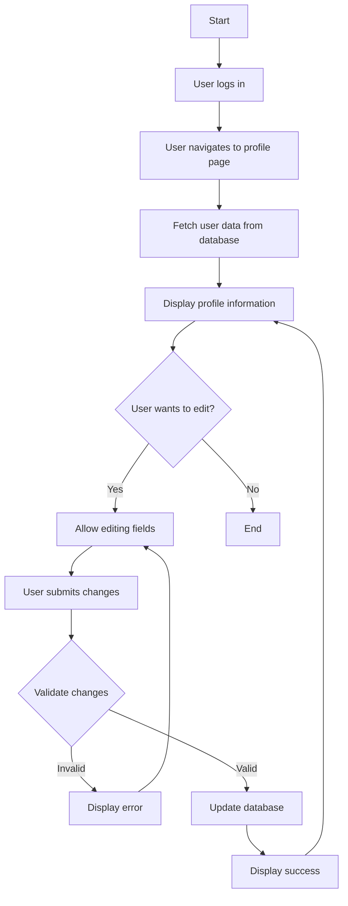

### Activity Diagram for Add Admin

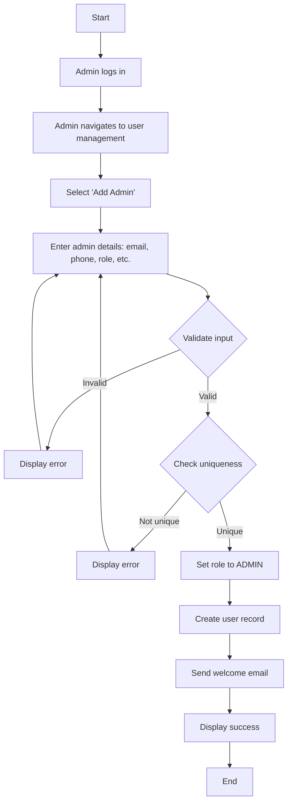

### Activity Diagram for Manage Customer

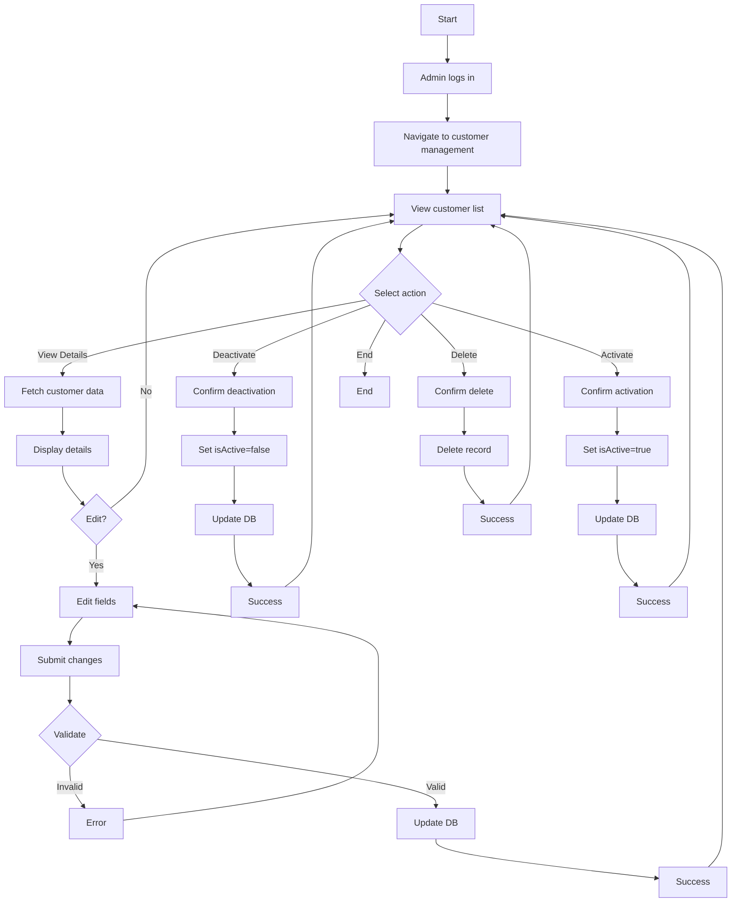

### Activity Diagram for Login

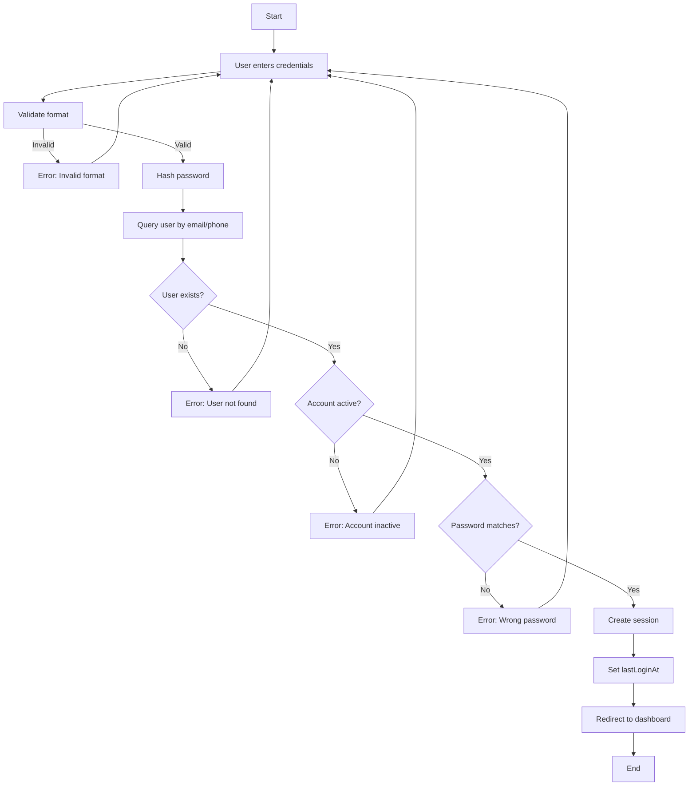

### Activity Diagram for Browse Products

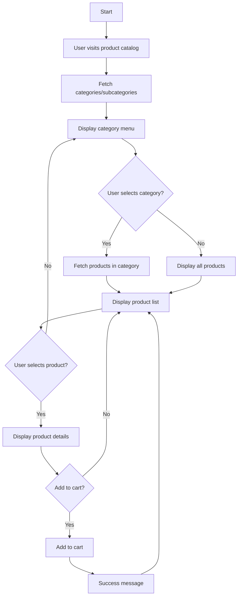

### Activity Diagram for Search Products

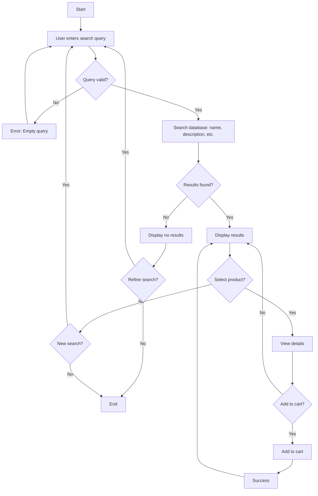

### Activity Diagram for Add to Cart

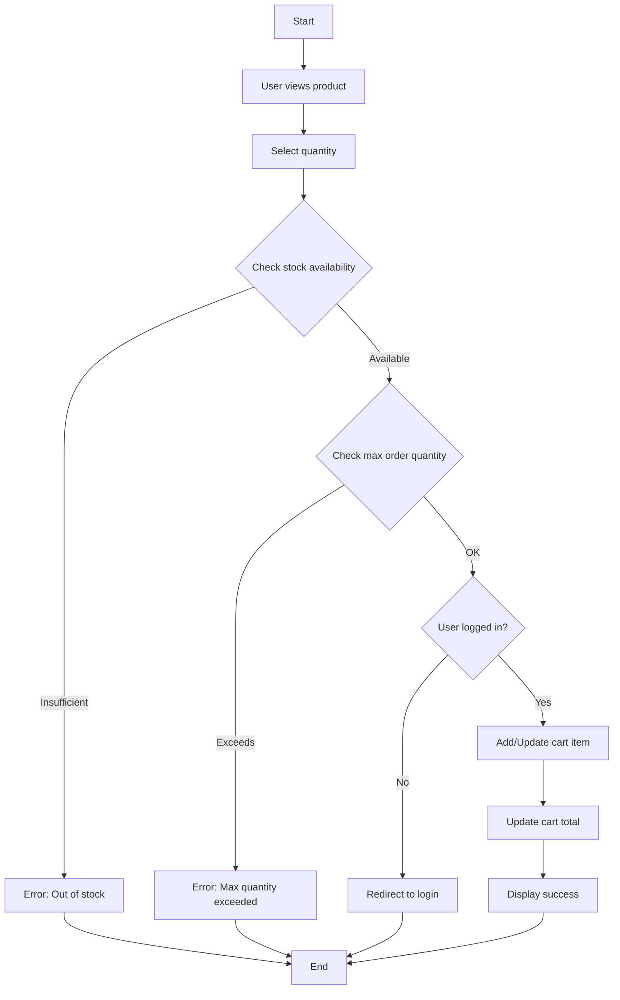

### Activity Diagram for Manage Cart

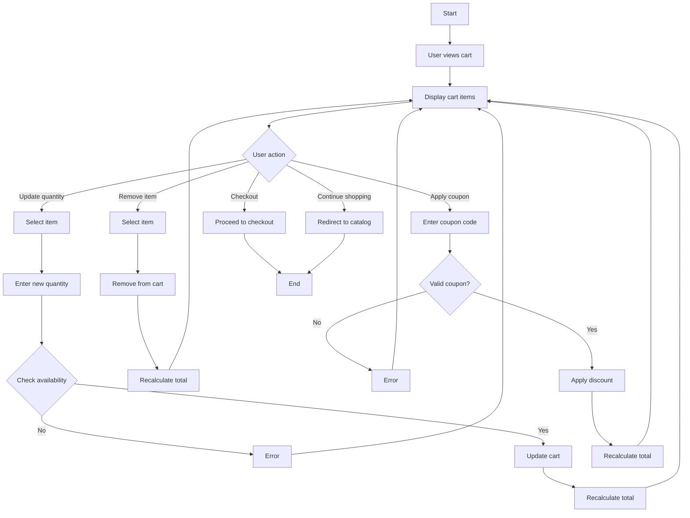

### Activity Diagram for Checkout

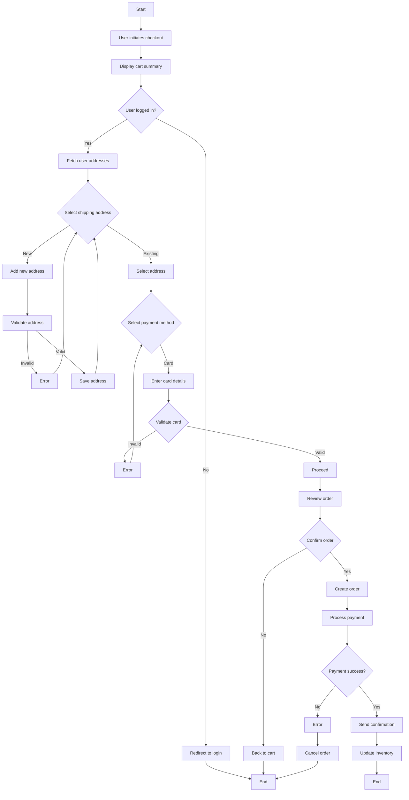

### Activity Diagram for Upload Prescription

```mermaid
flowchart TD
    A[Start] --> B[User logs in]
    B --> C[Navigate to prescriptions]
    C --> D[Select upload]
    D --> E[Choose file]
    E --> F{Valid file type? (image/pdf)}
    F -->|No| G[Error: Invalid file]
    G --> D
    F -->|Yes| H{File size OK?}
    H -->|No| I[Error: File too large]
    I --> D
    H -->|Yes| J[Upload file]
    J --> K[Extract metadata if possible]
    K --> L[Create prescription record]
    L --> M[Set status to PENDING]
    M --> N[Send notification to user]
    N --> O[Display success]
    O --> P[End]
```

### Activity Diagram for Verify Prescription

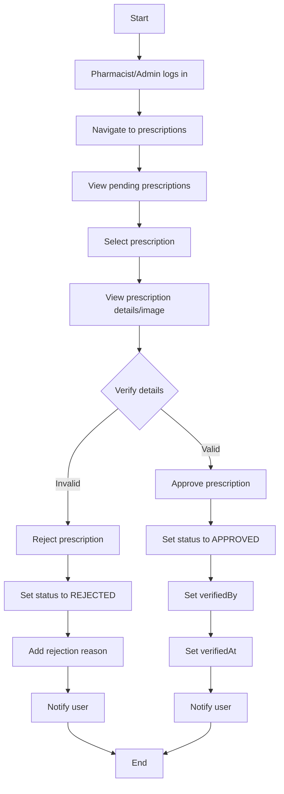

### Activity Diagram for Place Order

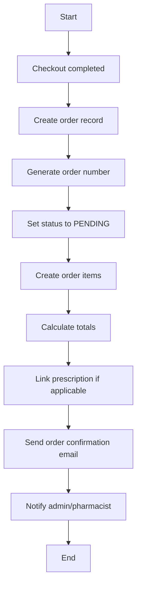

### Activity Diagram for Process Payment

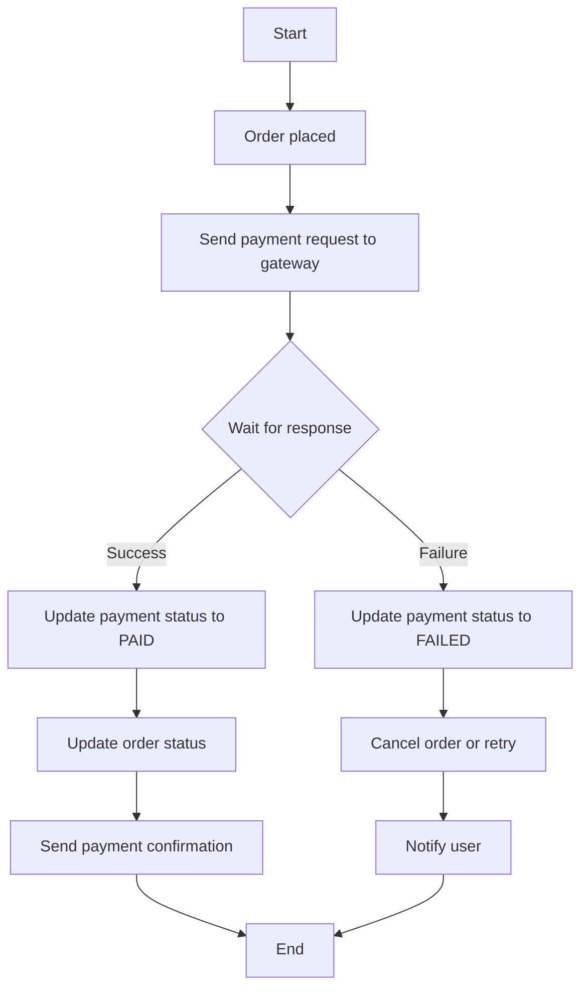

### Activity Diagram for Track Order

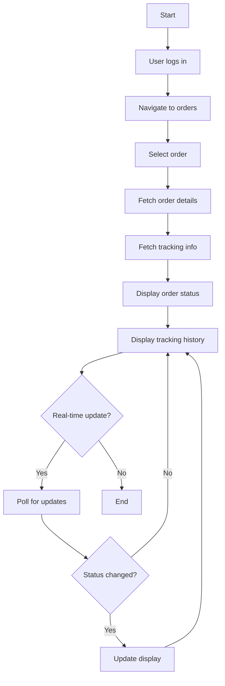

### Activity Diagram for Manage Users

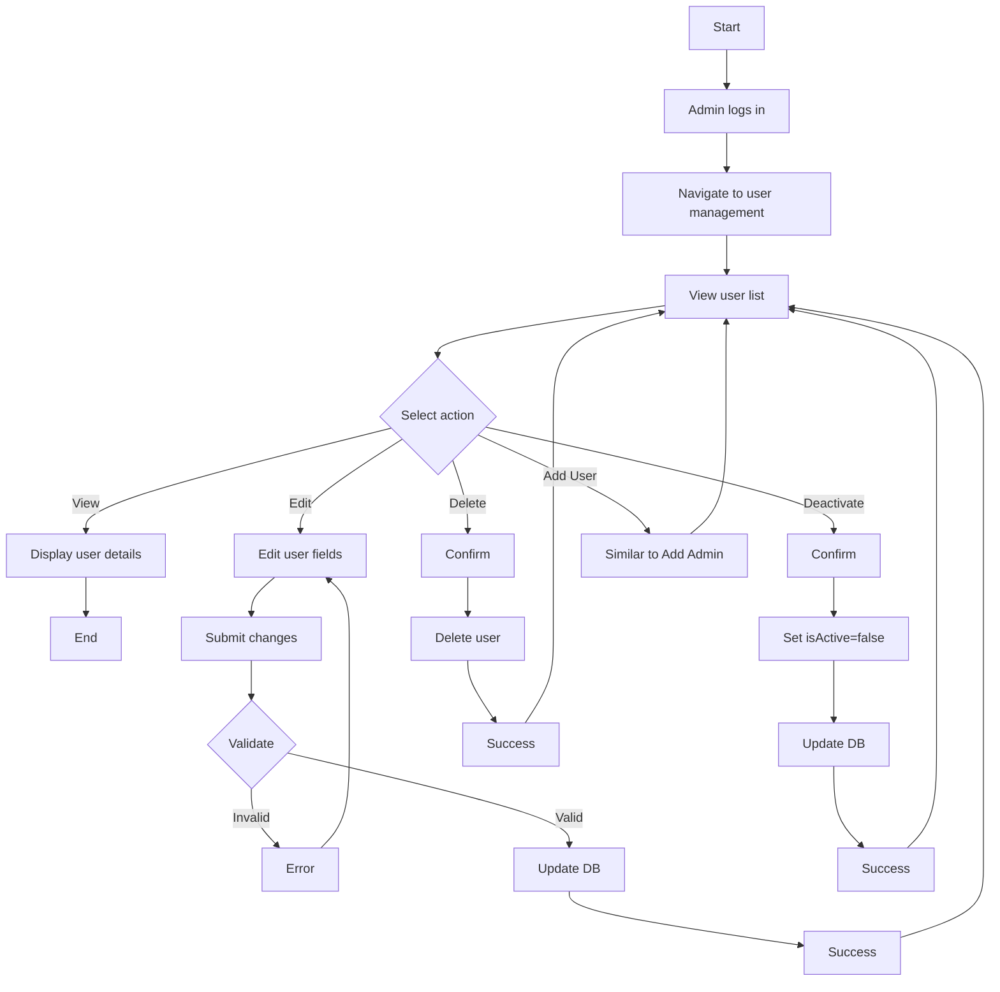

### Activity Diagram for Manage Products

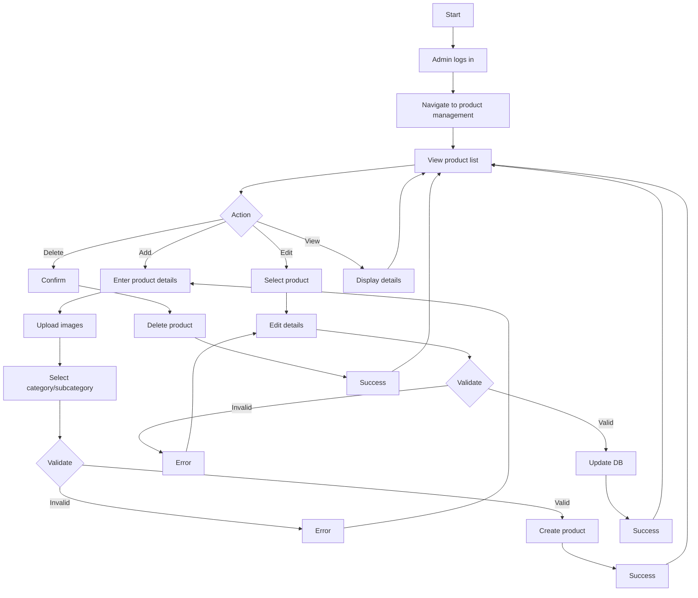

### Activity Diagram for Manage Inventory

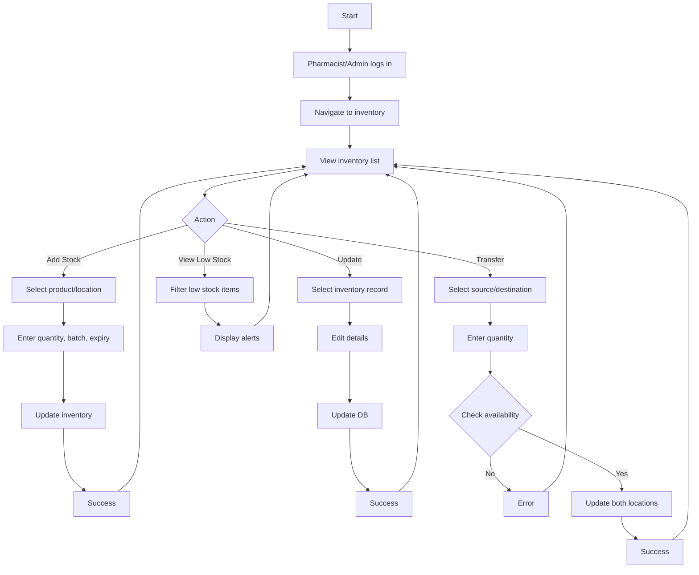

### Activity Diagram for Generate Reports

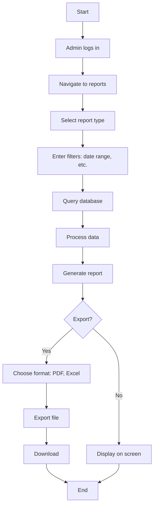

### Activity Diagram for Update Delivery Status

```mermaid
flowchart TD
    A[Start] --> B[Delivery Partner logs in]
    B --> C[View assigned orders]
    C --> D[Select order]
    D --> E[Update status: location, description]
    E --> F[Save tracking record]
    F --> G[Update order status]
    G --> H[Notify user]
    H --> I[Success]
    I --> C
```

### Activity Diagram for Supply Products

```mermaid
flowchart TD
    A[Start] --> B[Supplier provides products]
    B --> C[System receives supply data]
    C --> D[Update inventory records]
    D --> E[Set received date]
    E --> F[Check for low stock alerts]
    F --> G[Notify admin if needed]
    G --> H[End]
```

### Activity Diagram for Geocode Addresses

```mermaid
flowchart TD
    A[Start] --> B[Address entered]
    B --> C[Check cache]
    C --> D{In cache?}
    D -->|Yes| E[Return cached coordinates]
    E --> F[End]
    D -->|No| G[Call geocoding API]
    G --> H{API response}
    H -->|Success| I[Store in cache]
    I --> J[Return coordinates]
    J --> F
    H -->|Failure| K[Retry or fallback]
    K --> L{Retry limit reached?}
    L -->|No| G
    L -->|Yes| M[Store failure in cache]
    M --> N[Return error]
    N --> F
```

### Activity Diagram for Query Chatbot

```mermaid
flowchart TD
    A[Start] --> B[User enters query]
    B --> C[Process query]
    C --> D[Search knowledge base]
    D --> E{Results found?}
    E -->|Yes| F[Generate response]
    F --> G[Display answer]
    G --> H[End]
    E -->|No| I[Provide fallback response]
    I --> G
```

---

## Swim-lane Diagrams

Swim-lane Diagrams show responsibilities across different actors for each functionality.

### Swim-lane Diagram for User Registration

```mermaid
flowchart TD
    subgraph User
        A[Enter details]
        C[Receive success]
    end
    subgraph System
        B[Validate input]
        D[Check uniqueness]
        E[Create user]
        F[Send verification]
    end
    A --> B
    B --> D
    D --> E
    E --> F
    F --> C
```

### Swim-lane Diagram for View User Profile

```mermaid
flowchart TD
    subgraph User
        A[Navigate to profile]
        C[View info]
        D[Edit if needed]
        F[Receive update confirmation]
    end
    subgraph System
        B[Fetch data]
        E[Validate changes]
        G[Update DB]
    end
    A --> B
    B --> C
    C --> D
    D --> E
    E --> G
    G --> F
```

### Swim-lane Diagram for Add Admin

```mermaid
flowchart TD
    subgraph Admin
        A[Enter admin details]
        C[Receive success]
    end
    subgraph System
        B[Validate input]
        D[Check uniqueness]
        E[Create admin user]
        F[Send welcome email]
    end
    A --> B
    B --> D
    D --> E
    E --> F
    F --> C
```

### Swim-lane Diagram for Manage Customer

```mermaid
flowchart TD
    subgraph Admin
        A[Select action]
        C[Confirm actions]
        E[Receive confirmations]
    end
    subgraph System
        B[Fetch data]
        D[Perform action: edit/deactivate/etc.]
        F[Update DB]
    end
    A --> B
    B --> C
    C --> D
    D --> F
    F --> E
```

### Swim-lane Diagram for Login

```mermaid
flowchart TD
    subgraph User
        A[Enter credentials]
        C[Receive error or success]
    end
    subgraph System
        B[Validate and authenticate]
        D[Create session]
    end
    A --> B
    B --> C
    B --> D
    D --> C
```

### Swim-lane Diagram for Browse Products

```mermaid
flowchart TD
    subgraph User
        A[Visit catalog]
        B[Select category]
        C[View products]
        D[Select product]
        E[View details]
        F[Add to cart if desired]
    end
    subgraph System
        G[Fetch categories]
        H[Fetch products]
        I[Display details]
        J[Add to cart]
    end
    A --> G
    G --> B
    B --> H
    H --> C
    C --> D
    D --> I
    I --> E
    E --> F
    F --> J
```

### Swim-lane Diagram for Search Products

```mermaid
flowchart TD
    subgraph User
        A[Enter query]
        B[View results]
        C[Select product]
        D[View details]
        E[Add to cart]
    end
    subgraph System
        F[Search DB]
        G[Display results]
        H[Show details]
        I[Add to cart]
    end
    A --> F
    F --> B
    B --> C
    C --> H
    H --> D
    D --> E
    E --> I
```

### Swim-lane Diagram for Add to Cart

```mermaid
flowchart TD
    subgraph User
        A[Select product]
        B[Choose quantity]
        D[Receive confirmation]
    end
    subgraph System
        C[Check stock]
        E[Add to cart]
        F[Update total]
    end
    A --> B
    B --> C
    C --> E
    E --> F
    F --> D
```

### Swim-lane Diagram for Manage Cart

```mermaid
flowchart TD
    subgraph User
        A[View cart]
        B[Update quantity/remove]
        C[Apply coupon]
        D[Proceed to checkout]
    end
    subgraph System
        E[Display items]
        F[Update cart]
        G[Recalculate total]
        H[Validate coupon]
        I[Apply discount]
    end
    A --> E
    B --> F
    F --> G
    C --> H
    H --> I
    I --> G
    D --> I
```

### Swim-lane Diagram for Checkout

```mermaid
flowchart TD
    subgraph User
        A[Initiate checkout]
        B[Select address]
        C[Enter payment]
        D[Confirm order]
    end
    subgraph System
        E[Display summary]
        F[Validate address]
        G[Process payment]
        H[Create order]
        I[Send confirmation]
    end
    A --> E
    B --> F
    C --> G
    D --> H
    H --> I
```

### Swim-lane Diagram for Upload Prescription

```mermaid
flowchart TD
    subgraph User
        A[Select file]
        C[Receive confirmation]
    end
    subgraph System
        B[Validate file]
        D[Upload and create record]
        E[Notify user]
    end
    A --> B
    B --> D
    D --> E
    E --> C
```

### Swim-lane Diagram for Verify Prescription

```mermaid
flowchart TD
    subgraph Pharmacist/Admin
        A[Review prescription]
        B[Approve/Reject]
        D[Receive notification]
    end
    subgraph System
        C[Update status]
        E[Notify user]
    end
    A --> B
    B --> C
    C --> E
    E --> D
```

### Swim-lane Diagram for Place Order

```mermaid
flowchart TD
    subgraph System
        A[Create order]
        B[Generate number]
        C[Create items]
        D[Send notifications]
    end
    A --> B
    B --> C
    C --> D
```

### Swim-lane Diagram for Process Payment

```mermaid
flowchart TD
    subgraph System
        A[Send to gateway]
        B[Receive response]
        C[Update status]
        D[Notify user]
    end
    subgraph Payment Gateway
        E[Process payment]
        F[Return result]
    end
    A --> E
    E --> F
    F --> B
    B --> C
    C --> D
```

### Swim-lane Diagram for Track Order

```mermaid
flowchart TD
    subgraph User
        A[View order]
        B[See status]
    end
    subgraph System
        C[Fetch data]
        D[Display tracking]
        E[Update if needed]
    end
    A --> C
    C --> D
    D --> B
    B --> E
```

### Swim-lane Diagram for Manage Users

```mermaid
flowchart TD
    subgraph Admin
        A[Select action]
        B[Enter data]
        C[Confirm]
        E[Receive result]
    end
    subgraph System
        D[Validate and perform]
        F[Update DB]
    end
    A --> D
    B --> D
    C --> D
    D --> F
    F --> E
```

### Swim-lane Diagram for Manage Products

```mermaid
flowchart TD
    subgraph Admin
        A[Select action]
        B[Enter product data]
        C[Upload images]
        D[Confirm]
        F[Receive result]
    end
    subgraph System
        E[Validate and save]
        G[Update DB]
    end
    A --> E
    B --> E
    C --> E
    D --> E
    E --> G
    G --> F
```

### Swim-lane Diagram for Manage Inventory

```mermaid
flowchart TD
    subgraph Pharmacist/Admin
        A[Select action]
        B[Enter inventory data]
        C[Confirm]
        E[Receive result]
    end
    subgraph System
        D[Validate and update]
        F[Update DB]
    end
    A --> D
    B --> D
    C --> D
    D --> F
    F --> E
```

### Swim-lane Diagram for Generate Reports

```mermaid
flowchart TD
    subgraph Admin
        A[Select report]
        B[Enter filters]
        C[Generate]
        D[Export if needed]
    end
    subgraph System
        E[Query DB]
        F[Process data]
        G[Create report]
        H[Export file]
    end
    A --> E
    B --> E
    E --> F
    F --> G
    C --> G
    D --> H
```

### Swim-lane Diagram for Update Delivery Status

```mermaid
flowchart TD
    subgraph Delivery Partner
        A[Select order]
        B[Update status]
        C[Save]
        E[Receive confirmation]
    end
    subgraph System
        D[Update tracking]
        F[Notify user]
    end
    A --> D
    B --> D
    C --> D
    D --> F
    F --> E
```

### Swim-lane Diagram for Supply Products

```mermaid
flowchart TD
    subgraph Supplier
        A[Provide supply data]
    end
    subgraph System
        B[Receive data]
        C[Update inventory]
        D[Send alerts if needed]
    end
    A --> B
    B --> C
    C --> D
```

### Swim-lane Diagram for Geocode Addresses

```mermaid
flowchart TD
    subgraph System
        A[Check cache]
        B[Call API]
        C[Store result]
        D[Return coordinates]
    end
    subgraph Geocoding Service
        E[Process request]
        F[Return data]
    end
    A --> B
    B --> E
    E --> F
    F --> C
    C --> D
```

### Swim-lane Diagram for Query Chatbot

```mermaid
flowchart TD
    subgraph User
        A[Enter query]
        C[Receive response]
    end
    subgraph System
        B[Search and generate]
        D[Display answer]
    end
    A --> B
    B --> D
    D --> C
```

---

## Detailed Entity Descriptions

### 1. User Management Entities

#### User

**Purpose**: Central entity representing system users (customers, admins, pharmacists, delivery partners)

**Attributes**:

- `id`: UUID (Primary Key)
- `email`: String (Unique)
- `phone`: String (Unique)
- `passwordHash`: String
- `firstName`: String
- `lastName`: String
- `role`: Enum (USER, ADMIN, PHARMACIST, DELIVERY_PARTNER)
- `dateOfBirth`: DateTime (Optional)
- `gender`: String (Optional)
- `isVerified`: Boolean (Default: false)
- `isActive`: Boolean (Default: true)
- `lastLoginAt`: DateTime (Optional)
- `createdAt`: DateTime
- `updatedAt`: DateTime

**Relationships**:

- 1:N with Sessions, Addresses, Orders, Prescriptions, Cart Items, Wishlist Items, Reviews, Saved Kits, Notifications
- 1:N with Admin Logs, Audit Logs (if admin)

**Indexes**: email, phone, role

#### Session

**Purpose**: Manages user authentication sessions

**Attributes**:

- `id`: CUID (Primary Key)
- `userId`: UUID (Foreign Key → User)
- `token`: String (Unique)
- `refreshToken`: String (Unique)
- `ipAddress`: String (Optional)
- `userAgent`: String (Optional)
- `expiresAt`: DateTime
- `isRevoked`: Boolean (Default: false)
- `createdAt`: DateTime

**Relationships**: N:1 with User

**Indexes**: userId, token, expiresAt

#### Address

**Purpose**: Stores user delivery/billing addresses

**Attributes**:

- `id`: CUID (Primary Key)
- `userId`: UUID (Foreign Key → User)
- `type`: String (Default: "shipping")
- `name`: String
- `phone`: String
- `addressLine1`: String
- `addressLine2`: String (Optional)
- `city`: String
- `area`: String
- `postalCode`: String (Optional)
- `latitude`: Float (Optional)
- `longitude`: Float (Optional)
- `isDefault`: Boolean (Default: false)
- `createdAt`: DateTime
- `updatedAt`: DateTime

**Relationships**: N:1 with User

**Indexes**: userId

### 2. Product Catalog Entities

#### Category

**Purpose**: Product categorization (e.g., Pain Relief, Antibiotics)

**Attributes**:

- `id`: CUID (Primary Key)
- `name`: String (Unique)
- `slug`: String (Unique, Optional)
- `description`: String (Optional)
- `imageUrl`: String (Optional)
- `icon`: String (Optional)
- `color`: String (Optional)
- `isActive`: Boolean (Default: true)
- `sortOrder`: Integer (Default: 0)
- `createdAt`: DateTime
- `updatedAt`: DateTime

**Relationships**: 1:N with Subcategories, 1:N with Products

**Indexes**: slug

#### Subcategory

**Purpose**: Sub-level categorization under categories

**Attributes**:

- `id`: CUID (Primary Key)
- `name`: String
- `slug`: String (Optional)
- `description`: String (Optional)
- `isActive`: Boolean (Default: true)
- `sortOrder`: Integer (Default: 0)
- `categoryId`: CUID (Foreign Key → Category)
- `createdAt`: DateTime
- `updatedAt`: DateTime

**Relationships**: N:1 with Category, 1:N with Products

**Constraints**: Unique(name, categoryId)

#### Product

**Purpose**: Individual pharmaceutical products

**Attributes**:

- `id`: CUID (Primary Key)
- `name`: String
- `slug`: String (Unique, Optional)
- `description`: String (Optional)
- `shortDescription`: String (Optional)
- `sku`: String (Unique, Optional)
- `brand`: String (Optional)
- `manufacturer`: String (Optional)
- `price`: Float
- `discountPrice`: Float (Optional)
- `costPrice`: Float
- `requiresPrescription`: Boolean (Default: false)
- `isOTC`: Boolean (Default: true)
- `strength`: String (Optional)
- `dosageForm`: String (Optional)
- `packSize`: String (Optional)
- `genericName`: String (Optional)
- `stockQuantity`: Integer (Default: 0)
- `minStockLevel`: Integer (Default: 10)
- `maxOrderQuantity`: Integer (Default: 10)
- `isActive`: Boolean (Default: true)
- `images`: String (Optional)
- `seoTitle`: String (Optional)
- `seoDescription`: String (Optional)
- `subcategoryId`: CUID (Foreign Key → Subcategory)
- `categoryId`: CUID (Foreign Key → Category, Optional)
- `createdAt`: DateTime
- `updatedAt`: DateTime

**Relationships**:

- N:1 with Category, N:1 with Subcategory
- 1:N with Cart Items, Wishlist Items, Reviews, Order Items, Inventory Records

**Indexes**: slug, sku, categoryId, requiresPrescription, isActive

### 3. Order Management Entities

#### Order

**Purpose**: Customer purchase orders

**Attributes**:

- `id`: CUID (Primary Key)
- `userId`: UUID (Foreign Key → User)
- `orderNumber`: String (Unique)
- `status`: Enum (PENDING, CONFIRMED, PROCESSING, SHIPPED, DELIVERED, CANCELLED, REFUNDED)
- `totalAmount`: Decimal
- `discountAmount`: Decimal (Default: 0)
- `shippingCost`: Decimal (Default: 0)
- `paymentMethod`: String (Optional)
- `paymentStatus`: Enum (PENDING, PAID, FAILED, REFUNDED)
- `paymentId`: String (Optional)
- `prescriptionId`: CUID (Foreign Key → Prescription, Optional)
- `shippingAddress`: String
- `billingAddress`: String (Optional)
- `deliveryZoneId`: CUID (Foreign Key → Delivery Zone, Optional)
- `deliveryDate`: DateTime (Optional)
- `notes`: String (Optional)
- `createdAt`: DateTime
- `updatedAt`: DateTime

**Relationships**: N:1 with User, N:1 with Prescription, 1:N with Order Items, 1:N with Order Tracking

**Indexes**: userId, orderNumber, status, createdAt

#### Order Item

**Purpose**: Individual items within an order

**Attributes**:

- `id`: CUID (Primary Key)
- `orderId`: CUID (Foreign Key → Order)
- `productId`: CUID (Foreign Key → Product)
- `quantity`: Integer
- `unitPrice`: Decimal
- `totalPrice`: Decimal
- `createdAt`: DateTime

**Relationships**: N:1 with Order, N:1 with Product

**Indexes**: orderId

#### Order Tracking

**Purpose**: Order status updates and tracking information

**Attributes**:

- `id`: CUID (Primary Key)
- `orderId`: CUID (Foreign Key → Order)
- `status`: String
- `location`: String (Optional)
- `description`: String (Optional)
- `createdAt`: DateTime

**Relationships**: N:1 with Order

**Indexes**: orderId, createdAt

### 4. Prescription Management

#### Prescription

**Purpose**: Digital prescription management and verification

**Attributes**:

- `id`: CUID (Primary Key)
- `referenceNumber`: String (Unique)
- `userId`: UUID (Foreign Key → User)
- `prescriptionImage`: String
- `patientName`: String (Optional)
- `patientAge`: Integer (Optional)
- `patientPhone`: String (Optional)
- `patientAddress`: String (Optional)
- `doctorName`: String (Optional)
- `doctorLicense`: String (Optional)
- `hospitalClinic`: String (Optional)
- `prescriptionDate`: DateTime (Optional)
- `items`: String (Optional)
- `status`: Enum (PENDING, APPROVED, REJECTED, EXPIRED)
- `expiresAt`: DateTime (Optional)
- `isReorderable`: Boolean (Default: true)
- `verifiedBy`: String (Optional)
- `verifiedAt`: DateTime (Optional)
- `adminNotes`: String (Optional)
- `createdAt`: DateTime
- `updatedAt`: DateTime

**Relationships**: N:1 with User, 1:N with Orders

**Indexes**: userId, status, expiresAt

### 5. Shopping Cart & Wishlist

#### Cart Item

**Purpose**: Items in user's shopping cart

**Attributes**:

- `id`: CUID (Primary Key)
- `userId`: UUID (Foreign Key → User)
- `productId`: CUID (Foreign Key → Product)
- `quantity`: Integer
- `createdAt`: DateTime
- `updatedAt`: DateTime

**Relationships**: N:1 with User, N:1 with Product

**Constraints**: Unique(userId, productId)

#### Wishlist Item

**Purpose**: User's saved products for future purchase

**Attributes**:

- `id`: CUID (Primary Key)
- `userId`: UUID (Foreign Key → User)
- `productId`: CUID (Foreign Key → Product)
- `createdAt`: DateTime

**Relationships**: N:1 with User, N:1 with Product

**Constraints**: Unique(userId, productId)

### 6. Inventory Management

#### Supplier

**Purpose**: Pharmaceutical suppliers and vendors

**Attributes**:

- `id`: CUID (Primary Key)
- `name`: String
- `contactPerson`: String (Optional)
- `email`: String (Optional)
- `phone`: String (Optional)
- `address`: String (Optional)
- `registrationId`: String (Optional)
- `isActive`: Boolean (Default: true)
- `createdAt`: DateTime
- `updatedAt`: DateTime

**Relationships**: 1:N with Inventory Records

#### Pickup Location

**Purpose**: Physical pharmacy locations for pickup

**Attributes**:

- `id`: CUID (Primary Key)
- `name`: String (Unique)
- `address`: String
- `lat`: Float (Optional)
- `lng`: Float (Optional)
- `open_hours`: String
- `is_active`: Boolean (Default: true)

**Relationships**: 1:N with Inventory Records

**Indexes**: lat, lng

#### Inventory

**Purpose**: Stock levels at different locations

**Attributes**:

- `id`: CUID (Primary Key)
- `productId`: CUID (Foreign Key → Product)
- `locationId`: CUID (Foreign Key → Pickup Location)
- `stock_quantity`: Integer (Default: 0)
- `updated_at`: DateTime
- `batchNumber`: String (Optional)
- `expiryDate`: DateTime (Optional)
- `quantity`: Integer
- `costPrice`: Decimal (Optional)
- `supplierId`: CUID (Foreign Key → Supplier, Optional)
- `receivedDate`: DateTime (Default: now)
- `createdAt`: DateTime

**Relationships**: N:1 with Product, N:1 with Pickup Location, N:1 with Supplier

**Constraints**: Unique(productId, locationId)

**Indexes**: productId, expiryDate

### 7. Review & Rating System

#### Review

**Purpose**: Customer product reviews and ratings

**Attributes**:

- `id`: CUID (Primary Key)
- `userId`: UUID (Foreign Key → User)
- `productId`: CUID (Foreign Key → Product)
- `rating`: Integer
- `comment`: String (Optional)
- `isVerified`: Boolean (Default: false)
- `status`: String (Default: "pending")
- `createdAt`: DateTime
- `updatedAt`: DateTime

**Relationships**: N:1 with User, N:1 with Product

**Constraints**: Unique(userId, productId)

**Indexes**: productId

### 8. Administrative Entities

#### Admin Log

**Purpose**: Administrative action logging

**Attributes**:

- `id`: CUID (Primary Key)
- `adminId`: UUID (Foreign Key → User)
- `action`: String
- `targetType`: String (Optional)
- `targetId`: String (Optional)
- `details`: JSON (Optional)
- `ipAddress`: String (Optional)
- `createdAt`: DateTime

**Relationships**: N:1 with User (admin)

**Indexes**: adminId, action, createdAt

#### Audit Log

**Purpose**: General user action auditing

**Attributes**:

- `id`: CUID (Primary Key)
- `userId`: UUID (Foreign Key → User)
- `action`: String
- `targetType`: String (Optional)
- `targetId`: String (Optional)
- `details`: String (Optional)
- `ipAddress`: String (Optional)
- `userAgent`: String (Optional)
- `createdAt`: DateTime

**Relationships**: N:1 with User

**Indexes**: userId, action, createdAt

### 9. Supporting Entities

#### Saved Kit

**Purpose**: User-created product bundles

**Attributes**:

- `id`: CUID (Primary Key)
- `userId`: UUID (Foreign Key → User)
- `name`: String
- `description`: String (Optional)
- `products`: JSON
- `totalPrice`: Decimal (Default: 0)
- `isPublic`: Boolean (Default: false)
- `createdAt`: DateTime
- `updatedAt`: DateTime

**Relationships**: N:1 with User

**Indexes**: userId

#### Notification

**Purpose**: User notifications and alerts

**Attributes**:

- `id`: CUID (Primary Key)
- `userId`: UUID (Foreign Key → User)
- `type`: String
- `title`: String
- `message`: String
- `isRead`: Boolean (Default: false)
- `metadata`: String (Optional)
- `createdAt`: DateTime

**Relationships**: N:1 with User

**Indexes**: userId, isRead, createdAt

#### Promotion

**Purpose**: Marketing promotions and discounts

**Attributes**:

- `id`: CUID (Primary Key)
- `code`: String (Unique)
- `title`: String
- `description`: String (Optional)
- `discountType`: String
- `discountValue`: Decimal
- `minOrderAmount`: Decimal (Default: 0)
- `maxDiscount`: Decimal (Optional)
- `startDate`: DateTime
- `endDate`: DateTime
- `usageLimit`: Integer (Optional, Default: 0)
- `usageCount`: Integer (Default: 0)
- `isActive`: Boolean (Default: true)
- `createdAt`: DateTime
- `updatedAt`: DateTime

**Indexes**: code, isActive

#### Coupon

**Purpose**: Discount coupons

**Attributes**:

- `id`: CUID (Primary Key)
- `code`: String (Unique)
- `discountType`: String
- `discountValue`: Decimal
- `minOrderAmount`: Decimal (Default: 0)
- `maxDiscount`: Decimal (Optional)
- `expiresAt`: DateTime (Optional)
- `usageLimit`: Integer (Optional, Default: 0)
- `usageCount`: Integer (Default: 0)
- `isActive`: Boolean (Default: true)
- `createdAt`: DateTime
- `updatedAt`: DateTime

**Indexes**: code, isActive

#### Delivery Zone

**Purpose**: Geographic delivery areas and pricing

**Attributes**:

- `id`: CUID (Primary Key)
- `name`: String
- `city`: String
- `areas`: String
- `shippingCost`: Decimal
- `deliveryTime`: String (Optional)
- `isActive`: Boolean (Default: true)
- `createdAt`: DateTime
- `updatedAt`: DateTime

**Indexes**: city, isActive

#### Shop

**Purpose**: Physical pharmacy store locations

**Attributes**:

- `id`: CUID (Primary Key)
- `name`: String
- `address`: String
- `open_hours`: String (Optional)
- `lat`: Float (Optional)
- `lng`: Float (Optional)
- `createdAt`: DateTime
- `updatedAt`: DateTime

#### Geocode Cache

**Purpose**: Caching geocoding results to reduce API calls

**Attributes**:

- `id`: CUID (Primary Key)
- `query`: String (Unique)
- `lat`: Float (Optional)
- `lng`: Float (Optional)
- `provider`: String (Optional)
- `status`: Enum (SUCCESS, FAILED, PENDING)
- `attempts`: Integer (Default: 0)
- `lastAttempt`: DateTime (Optional)
- `error`: String (Optional)
- `createdAt`: DateTime
- `updatedAt`: DateTime

#### Chatbot Document

**Purpose**: Knowledge base for AI chatbot

**Attributes**:

- `id`: CUID (Primary Key)
- `docId`: String (Unique)
- `title`: String
- `source`: String
- `category`: String (Optional)
- `content`: String
- `url`: String (Optional)
- `metadata`: String (Optional)
- `createdAt`: DateTime
- `updatedAt`: DateTime

**Indexes**: category

#### Vector Embedding

**Purpose**: AI vector embeddings for semantic search

**Attributes**:

- `id`: CUID (Primary Key)
- `docId`: String (Unique)
- `vector`: String (Optional)
- `metadata`: String (Optional)
- `createdAt`: DateTime
- `updatedAt`: DateTime

---

## Enumeration Types

### Role

- `USER`: Regular customer
- `ADMIN`: System administrator
- `PHARMACIST`: Pharmacy staff
- `DELIVERY_PARTNER`: Delivery personnel

### Order Status

- `PENDING`: Order placed, awaiting confirmation
- `CONFIRMED`: Order confirmed by pharmacy
- `PROCESSING`: Order being prepared
- `SHIPPED`: Order dispatched for delivery
- `DELIVERED`: Order delivered to customer
- `CANCELLED`: Order cancelled
- `REFUNDED`: Order refunded

### Prescription Status

- `PENDING`: Awaiting verification
- `APPROVED`: Verified and approved
- `REJECTED`: Verification failed
- `EXPIRED`: Prescription expired

### Payment Status

- `PENDING`: Payment initiated
- `PAID`: Payment successful
- `FAILED`: Payment failed
- `REFUNDED`: Payment refunded

### Geocode Status

- `SUCCESS`: Geocoding successful
- `FAILED`: Geocoding failed
- `PENDING`: Geocoding in progress

---

## Key Relationships Summary

### One-to-Many Relationships

- User → Sessions, Addresses, Orders, Prescriptions, Cart Items, Wishlist Items, Reviews, Saved Kits, Notifications
- Category → Subcategories, Products
- Subcategory → Products
- Product → Cart Items, Wishlist Items, Reviews, Order Items, Inventory Records
- Order → Order Items, Order Tracking
- Supplier → Inventory Records
- Pickup Location → Inventory Records
- Prescription → Orders

### Many-to-One Relationships

- Session → User
- Address → User
- Order → User, Prescription
- Order Item → Order, Product
- Order Tracking → Order
- Prescription → User
- Cart Item → User, Product
- Wishlist Item → User, Product
- Review → User, Product
- Saved Kit → User
- Notification → User
- Inventory → Product, Pickup Location, Supplier
- Admin Log → User (admin)
- Audit Log → User

### Many-to-Many Relationships

- None (handled through junction tables like Order Items, Cart Items, etc.)

---

## Database Constraints and Business Rules

### Unique Constraints

- User: email, phone
- Session: token, refreshToken
- Category: name, slug
- Subcategory: (name, categoryId)
- Product: slug, sku
- Order: orderNumber
- Prescription: referenceNumber
- Cart Item: (userId, productId)
- Wishlist Item: (userId, productId)
- Review: (userId, productId)
- Promotion: code
- Coupon: code
- Pickup Location: name
- Geocode Cache: query
- Chatbot Document: docId
- Vector Embedding: docId

### Foreign Key Constraints

- All foreign keys have appropriate cascade/no-action behaviors
- User deletion cascades to related entities
- Category/Subcategory deletion affects products appropriately

### Business Logic Constraints

- Products requiring prescriptions cannot be OTC
- Order totals must match sum of item totals
- Inventory quantities cannot be negative
- Prescription expiry dates prevent reordering
- User roles determine access permissions

---

## Performance Optimization

### Indexing Strategy

- Primary keys automatically indexed
- Foreign keys indexed for join performance
- Frequently queried fields indexed (email, phone, status, dates)
- Composite indexes where appropriate
- Geospatial indexes for location-based queries

### Query Optimization

- Connection pooling via Prisma
- Efficient JOIN operations
- Selective field fetching with `select`
- Pagination for large result sets
- Caching for geocoding and frequently accessed data

---

## Data Integrity and Security

### Audit Trail

- Admin Log: Administrative actions
- Audit Log: User actions and system events
- Session tracking with IP and user agent

### Data Validation

- Email and phone uniqueness
- Required fields enforcement
- Data type constraints
- Business rule validation in application layer

### Backup and Recovery

- PostgreSQL native backup capabilities
- Point-in-time recovery support
- Schema versioning via Prisma migrations

---

This database design supports a comprehensive pharmacy e-commerce platform with robust user management, inventory tracking, prescription handling, and order processing capabilities. The normalized schema ensures data integrity while providing flexibility for future enhancements.</content>
<parameter name="filePath">/home/kingshuk/Online24-Pharmacy/DATABASE_DESIGN_DOCUMENTATION.md
````
